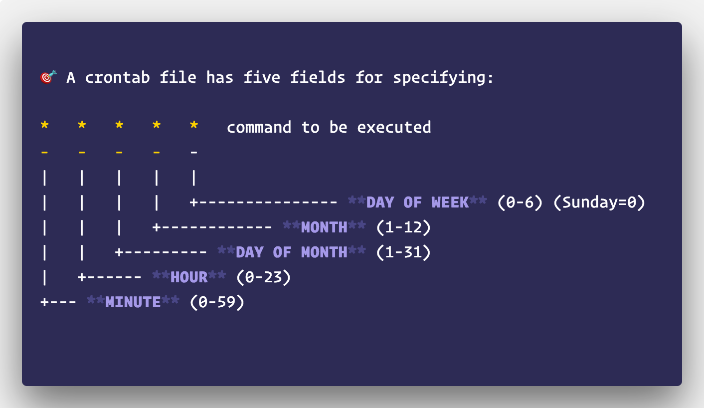

## Daftar Isi

1. [Cron](#1-cron)
    - [1.1 Membuat atau mengubah cron jobs](#11-membuat-atau-mengubah-cron-jobs)
2. [AWK](#2-awk)
    - [2.1 Menjalankan Program AWK](#21-menjalankan-program-awk)
    - [2.2 Special Rules](#22-special-rules)
3. [Referensi](#referensi)

# 1. Cron
Cron adalah sebuah service daemon yang memungkinkan user Linux dan Unix untuk menjalankan perintah atau _script_ pada waktu tertentu secara otomatis. Perintah-perintah dan/atau script-script yang dijalankan cron disebut cron jobs.
Syntax crontab :
`crontab [-u user] [-l | -r | -e] [-i]`
Penjelasan :
* `-l` untuk menampilkan isi file crontab
* `-r` untuk menghapus file crontab
* `-e` untuk mengubah atau membuat file crontab jika belum ada
* `-i` untuk memberikan pertanyaan konfirmasi terlebih dahulu sebelum menghapus file crontab
## 1.1 Membuat atau mengubah cron jobs
1. Ketikkan `crontab -e`
2. Ketikkan perintah crontab sesuai aturan parameter crontab   
   
3. Untuk melihat daftar cron jobs ketikkan `crontab -l`

Contoh perintah yang dijalankan crontab   
   
Penjelasan :
* setiap jam 00.00 memasukkan hasil `ls /home/tamtama` ke file `/home/tamtama/list_files`
* setiap minggu menjalankan file `script.sh` pada folder `/home/tamtama`

Untuk belajar lebih lanjut perintah-perintah crontab bisa mengakses website [crontab guru](https://crontab.guru/).   


# 2. AWK
__awk__ merupakan sebuah program yang bisa digunakan untuk mengambil catatan/record tertentu dalam sebuah file dan melakukan sebuah/beberapa operasi terhadap catatan/record tersebut.

Fungsi dasar awk adalah memeriksa sebuah file per barisnya (atau satuan teks lain) yang mengandung pola tertentu. Ketika sebuah baris cocok dengan salah satu pola, awk akan melakukan action tertentu pada baris tersebut. awk melanjutkan proses sampai menemui end of file pada file yang menjadi masukan tadi.

FYI: awk versi baru dinamakan gawk, tapi biasanya tetap disebut awk.

Awk adalah bahasa scripting yang digunakan untuk memanipulasi data dan menghasilkan laporan. Bahasa pemrograman perintah awk tidak memerlukan kompilasi, dan memungkinkan pengguna untuk menggunakan variabel, fungsi numerik, fungsi string, dan operator logika. Awk sebagian besar digunakan untuk pemindaian dan pemrosesan pola.

## 2.1 Menjalankan Program AWK
Syntax:
```bash
awk options 'selection _criteria {action }' input-file > output-file
```
### Cara Kerja AWK
- Awk membaca baris dalam sebuah file.

- Untuk beberapa baris, ini dicocokkan dengan pola yang dibuat. Jika polanya cocok maka keputusan selanjutnya bisa dilakukan, seperti print misalnya.

- Jika tidak ada pola yang cocok, maka tidak ada action/keputusan yang akan diambil.

- Memberikan pola atau action tidak diharuskan.

- Jika tidak ada pola yang dibuat, maka output default nya adalah setiap baris dari file yang anda pakai.

- Jika tidak ada action/keputusan yang dibuat, maka output default nya adalah memunculkan hasil pencarian pada layar anda.

- Kurung kurawal tanpa action itu artinya tidak ada keputusan, tapi tidak akan memunculkan output default tadi.

- Setiap statemen dalam action harus di pisahkan dengan tanda titik koma (;)

Misalnya kita memiliki data kerajaan sebagai berikut:
```
mataram sanjaya 732 760
kutai mulawarman  400 446
singasari ken 1222 1227
majapahit gajahmada 1334 1364
tarumanegara sanjaya 732 754
sriwijaya balaputradewa 792 835
```
Secara default awk akan print semua baris pada file masukan:  
`awk '{print}' kerajaan.txt`  

Print baris yang mengandung pola yang dimasukkan:
`awk '/sanjaya/ {print}' kerajaan.txt`  
Maka hasilnya adalah sebagai berikut:
```
mataram sanjaya 732 760
tarumanegara sanjaya 732 754
```
Dalam setiap baris, awk akan membagi setiap kata yang dipisahkan oleh spasi dan menyimpannya pada variabel $n. Jika terdapat 4 kata pada satu baris, maka kata pertama akan disimpan pada variabel $1, kata kedua pada variabel $2, dan seterusnya. $0 merepresentasikan semua kata yang ada pada satu baris.

`awk '/ken/ {print $1,$2}' kerajaan.txt`  
Maka hasilnya adalah sebagai berikut:
```
singasari ken
```
Catatan: Dalam rule program awk boleh menghilangkan hanya salah satu di antara action atau pola. Jika pola dihilangkan, maka action akan diberlakukan ke semua baris. Sedangkan jika action dihilangkan, maka setiap baris yang mengandung pola tersebut akan secara default ditampilkan secara penuh.

## 2.2 Special Rules
Program awk memiliki rule yang memiliki kelakuan khusus. Di antaranya adalah BEGIN dan END. Rule BEGIN hanya dieksekusi satu kali, yaitu sebelum input dibaca. Rule END pun juga dieksekusi satu kali, hanya setelah semua input selesai dibaca. Contoh:
```bash
awk '
BEGIN { print "Ada berapa \"732\"?" }
/732/  { ++n }
END   { print "\"732\" muncul", n, "kali." }' kerajaan.txt
```
Maka hasilnya adalah sebagai berikut:
```
Ada berapa "732"?

"732" muncul 2 kali.
```
Pada contoh di atas, rule kedua hanya memiliki action untuk melakukan perhitungan berapa jumlah baris yang mengandung "732", namun tidak ada action untuk menampilkan (print).

## Referensi
* Modul 1 Praktikum Sistem Operasi TC 2020
* [https://www.computerhope.com/unix/ucrontab.htm](https://www.computerhope.com/unix/ucrontab.htm)
* [https://www.codepolitan.com/memahami-perintah-perintah-crontab-paling-lengkap-59f69445130a0](https://www.codepolitan.com/memahami-perintah-perintah-crontab-paling-lengkap-59f69445130a0)
* [https://vpswp.blogspot.com/2015/06/definisi-dan-6-contoh-fungsi-perintah-awk-linux.html](https://vpswp.blogspot.com/2015/06/definisi-dan-6-contoh-fungsi-perintah-awk-linux.html)
